# Coding Progression System 🎮


Геймифицированный дневник кодинга для Obsidian: один Python-скрипт превращает
данные [WakaTime](https://wakatime.com) в ежедневную заметку с XP, уровнями,
стриками, ачивками, "деревом навыков" по языкам, таблицей лидеров и другими
виджетами. И всё это в виде красиво оформленных карточек прямо в Obsidian 💜

## Скриншоты

<p align="center">
  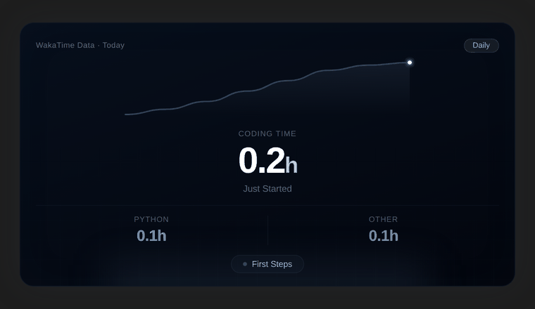
  &nbsp;&nbsp;
  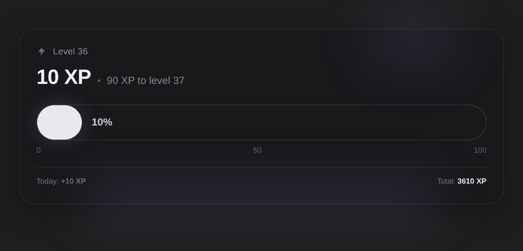
</p>

<table>
<tr>
<td>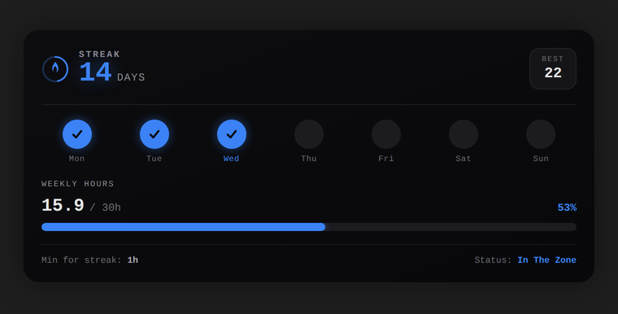</td>
<td>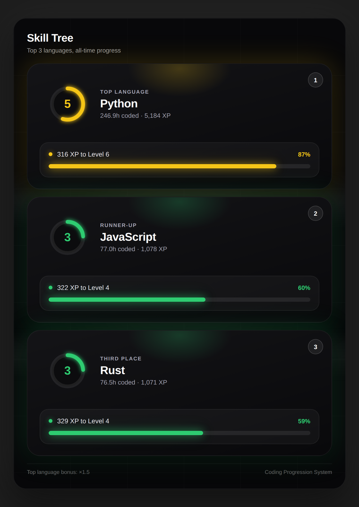</td>
</tr>
<tr>
<td>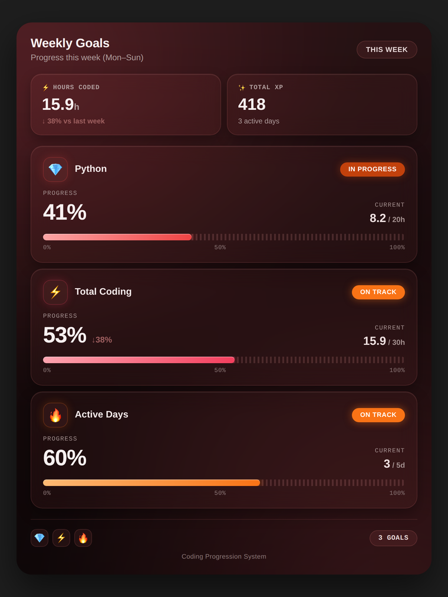</td>
<td>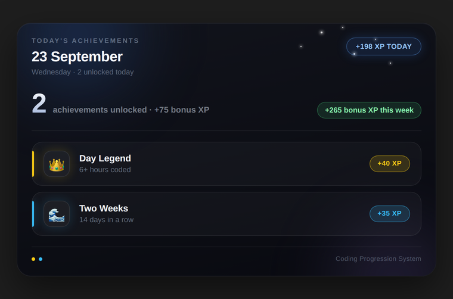</td>
</tr>
<tr>
<td>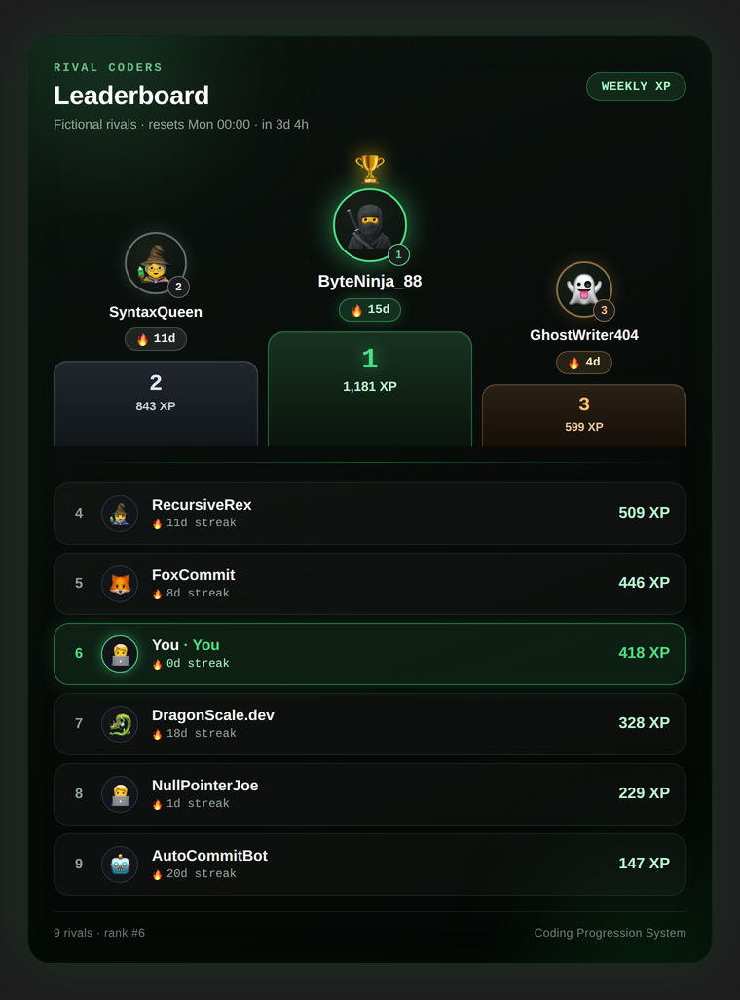</td>
<td>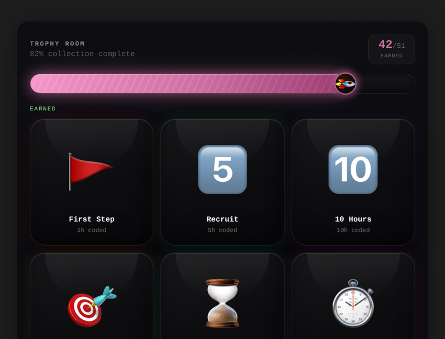</td>
</tr>
<tr>
<td>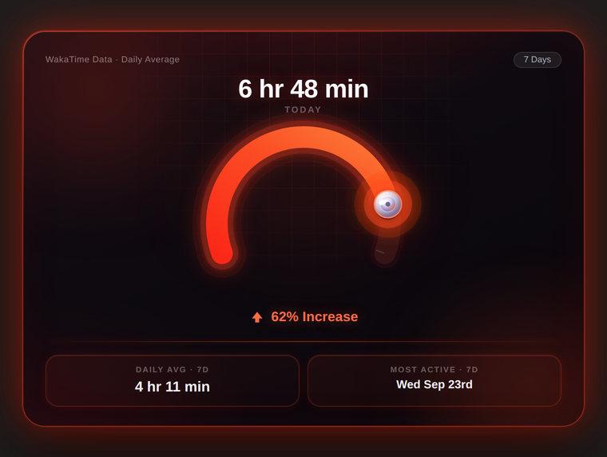</td>
<td>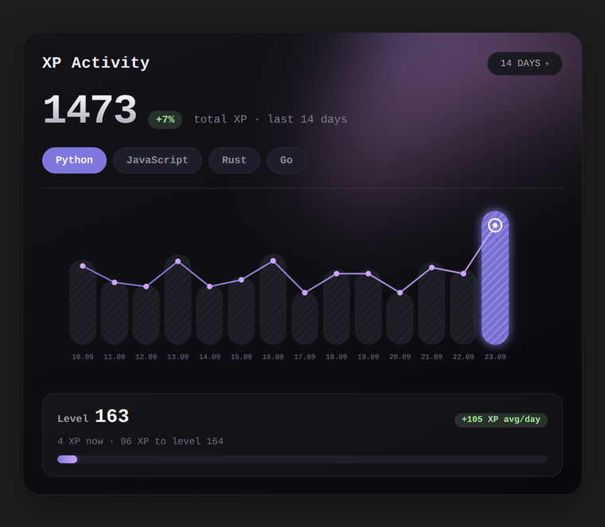</td>
</tr>
<tr>
<td>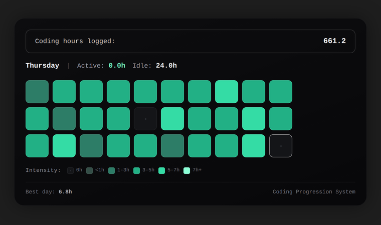</td>
<td>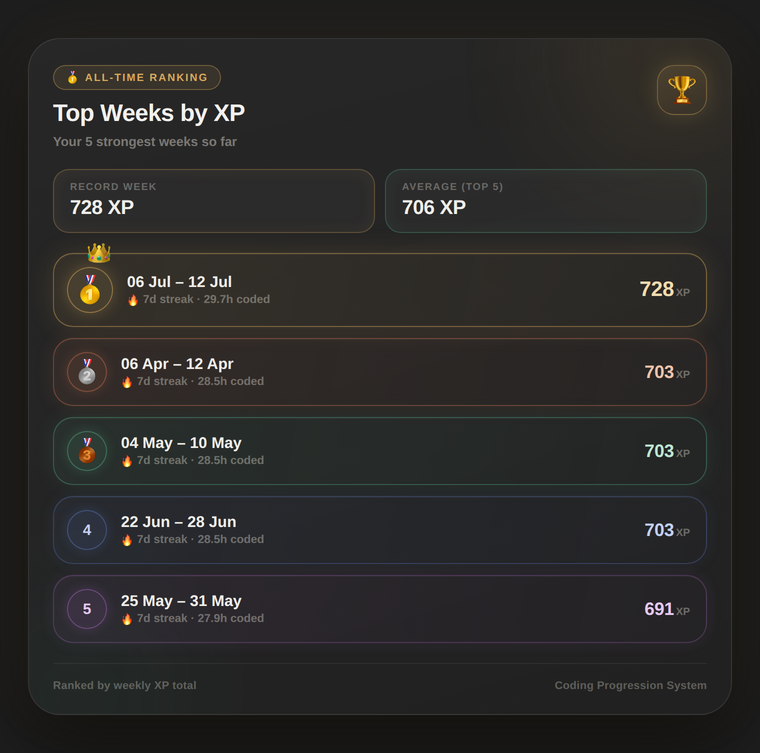</td>
</tr>
</table>

## Что нужно

- Python 3.9+
- [Obsidian](https://obsidian.md) с установленным плагином **Dataview**
  (виджеты используют `dataviewjs`, поэтому в настройках Dataview должен быть
  включён JavaScript Queries)
- Аккаунт [WakaTime](https://wakatime.com) с установленным плагином-трекером
  для вашего редактора/IDE

## Установка

1. Скачайте `wakatime_to_obsidian.py` с последнего релиза.
2. Установите единственную зависимость:
   ```
   pip install requests
   ```
3. Откройте `wakatime_to_obsidian.py` и заполните блок `НАСТРОЙКИ` в начале файла:
   - `WAKATIME_API_KEY` — ваш ключ, страница `https://wakatime.com/settings/api-key`
   - `VAULT_PATH` — абсолютный путь до вашего Obsidian vault
   - при желании поменяйте `DAILY_FOLDER` (папка для daily notes внутри vault, по умолчанию `daily`)
4. Запустите:
   ```
   python wakatime_to_obsidian.py
   ```
   Скрипт создаст заметку `<vault>/daily/ГГГГ-ММ-ДД.md` за сегодняшний день.
5. Откройте эту заметку в Obsidian — виджеты `dataviewjs` отрисуются автоматически.

Если поля не заполнены или указанный путь не существует, скрипт остановится
с понятным сообщением о том, что нужно исправить — ничего никуда не запишет.

## Автозапуск каждый вечер (необязательно)

Через cron (Linux/macOS):
```
0 23 * * * /usr/bin/python3 /полный/путь/до/wakatime_to_obsidian.py
```
На Windows для той же цели используйте Планировщик заданий.

## Настройка под себя

В начале файла, помимо ключа и пути, есть несколько групп констант,
которые можно менять без риска что-то сломать:

- `XP_PER_HOUR`, `TOP_LANG_BONUS`, `STREAK_BONUS_PER_DAY` — формула начисления XP
- `ACHIEVEMENT_THRESHOLDS` — пороги дневных ачивок (в часах)
- `ACHIEVEMENT_HOUR_BONUS` / `ACHIEVEMENT_STREAK_BONUS` / `ACHIEVEMENT_MILESTONE_BONUS` — бонусы XP за разблокированные ачивки
- `WEEKLY_GOALS` — цели на неделю (часы топ-языка, часы всего, дни подряд)

Все виджеты берут эти значения из Python-констант через f-string, поэтому
цифры в интерфейсе никогда не разойдутся с реальной логикой начисления XP.

## Важно про приватность

`WAKATIME_API_KEY` — секретный ключ, не публикуйте файл с уже заполненным
значением (например, не коммитьте его в открытый git-репозиторий).

## Лицензия

MIT — используйте, меняйте и распространяйте свободно.

---

Нашли баг или есть идея? — [создайте issue](../../issues/new)
 
<p align="center">
  <b>Управляешь прогрессом — получаешь удовольствие от процесса</b>
</p>
<p align="center">
  <b>nikITa</b> — контент про IT и разработку<br>
  📱 Telegram: <a href="https://t.me/code_nikITa">@code_nikITa</a> ·
  ▶️ YouTube: <a href="https://www.youtube.com/@nikITa_in_IT">nikITa - путь в IT</a>
</p>